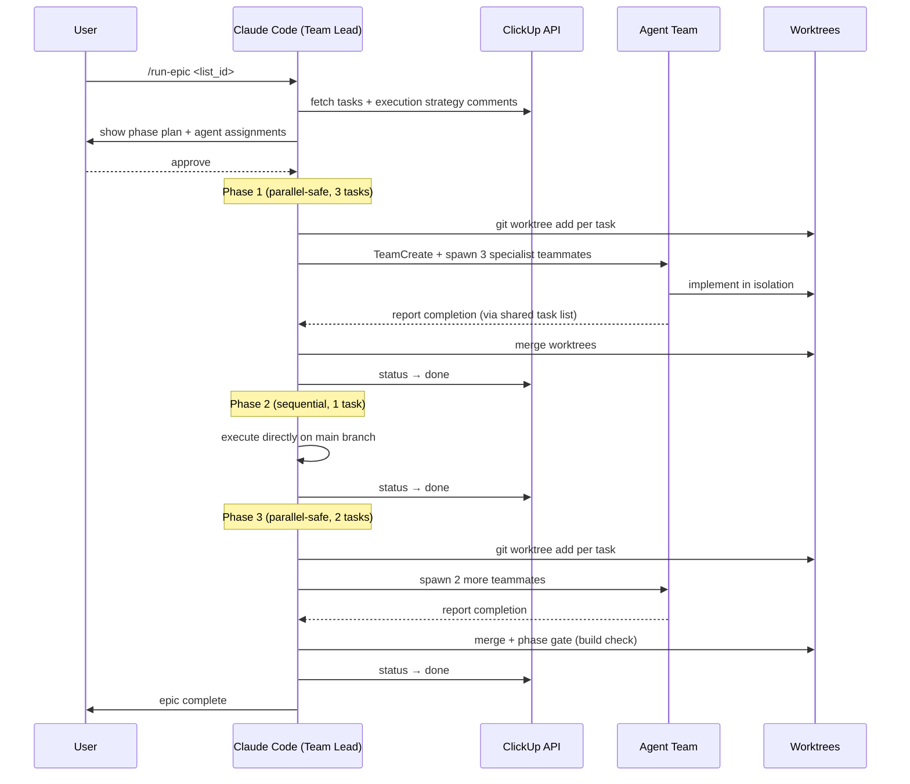
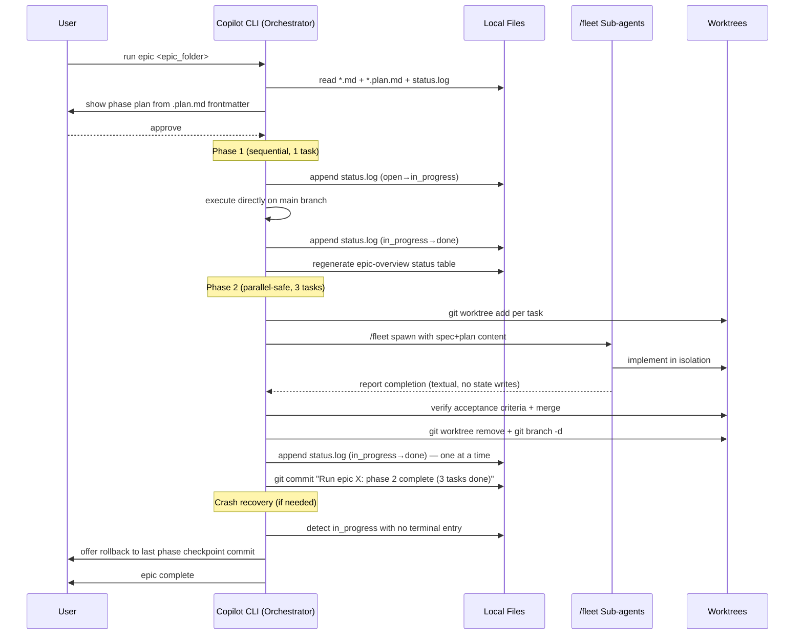

# Agent Teams Epic Pipeline Workflow

> Transform PRDs into implemented code through a six-stage pipeline — with **two runtime flavors** depending on whether your organization has ClickUp access.

This repository contains two parallel implementations of the same epic pipeline — one that runs on **Claude Code with agent teams** (ClickUp-backed), and one that runs on **GitHub Copilot CLI with `/fleet` sub-agents** (local-file-backed). Both implement the same six-stage workflow: research → draft → freeze → enrich → plan → execute. Pick the flavor that matches your runtime and your org's tooling.

---

## The six-stage workflow

Both pipelines share the same abstract workflow:

```
┌───────────┐   ┌───────────┐   ┌─────────────┐   ┌──────────────┐   ┌───────────────┐   ┌────────────┐
│ seed-prd  │ → │ seed-epic │ → │  finalize / │ → │ enrich-epic  │ → │ analyze-epic  │ → │  run-epic  │
│           │   │           │   │    push     │   │              │   │               │   │            │
│ research  │   │ PRD →     │   │ freeze the  │   │ enrich with  │   │ build DAG     │   │ execute    │
│ → PRD     │   │ task      │   │ spec        │   │ codebase     │   │ & plan phases │   │ in phases  │
│ docs      │   │ files     │   │             │   │ context      │   │               │   │            │
└───────────┘   └───────────┘   └─────────────┘   └──────────────┘   └───────────────┘   └────────────┘
   AUTHOR         DRAFT            HANDOFF           PREPARE             PREPARE            EXECUTE
```

Each stage has a single responsibility, produces output the next stage consumes, and gates on a user confirmation before making changes.

---

## Two runtimes, one workflow

|                     | `.claude/skills/`                           | `.github/skills/`                                |
|---------------------|---------------------------------------------|--------------------------------------------------|
| **Runtime**         | Claude Code                                 | GitHub Copilot CLI                               |
| **Backing store**   | ClickUp (API-backed task list)              | Local files (markdown + git)                     |
| **State machine**   | ClickUp task status                         | Append-only `status.log` per epic                |
| **Execution plan**  | `EXECUTION STRATEGY` comments on tasks      | `<NN>-<slug>.plan.md` sidecar files              |
| **Parallelization** | **Claude Code agent teams** (tmux mode)     | **Copilot CLI `/fleet` sub-agents** + worktrees  |
| **Isolation**       | Git worktrees per parallel task             | Git worktrees per parallel task                  |
| **Audit trail**     | ClickUp comments & activity log             | Git commit history + `status.log`                |
| **Handoff skill**   | `push-epic-to-clickup`                      | `finalize-epic`                                  |
| **Target audience** | Teams with ClickUp access                   | Orgs without ClickUp access                      |

The workflow shape, the user interaction model, and the skill responsibilities are **identical** across both flavors. Only the I/O layer and the parallelization primitive differ.

---

## Pipeline A: `.claude/skills/` — Claude Code + Agent Teams

**Runtime:** Claude Code with experimental agent teams (`CLAUDE_CODE_EXPERIMENTAL_AGENT_TEAMS=1`, tmux mode).
**Backing store:** ClickUp. Tasks, descriptions, dependencies, and status all live in a ClickUp list.
**Parallelization:** The session running `run-epic` acts as the team lead. For parallel-safe phases, it spawns specialist agents directly via Claude Code's team primitives. Each agent works in its own git worktree; the lead merges worktree branches at phase gates.

### How it runs



**Key architectural traits:**
- The lead session IS the team — it creates the team via `TeamCreate`, spawns all teammates directly, and manages phase gates. Teammates cannot spawn other teammates.
- A shared task list is visible to all teammates (toggle with `Ctrl+T`).
- Phase gates between parallel windows merge worktree branches and run `pnpm run build` before proceeding.
- The `oshq-frontend` agent is a custom Claude Code agent built specifically for this codebase's patterns (admin page RSC → server action → client component).

### Skills

| Stage | Skill | Location |
|---|---|---|
| 0 | `seed-prd` | [`.claude/skills/seed-prd/`](.claude/skills/seed-prd/SKILL.md) |
| 1 | `seed-epic` | [`.claude/skills/seed-epic/`](.claude/skills/seed-epic/SKILL.md) |
| 2 | `push-epic-to-clickup` | *(plugin skill, lives in `~/.claude/skills/`)* |
| 3 | `enrich-epic` | [`.claude/skills/enrich-epic/`](.claude/skills/enrich-epic/references/enrichment-criteria.md) |
| 4 | `analyze-epic` | [`.claude/skills/analyze-epic/`](.claude/skills/analyze-epic/SKILL.md) |
| 5 | `run-epic` | [`.claude/skills/run-epic/`](.claude/skills/run-epic/references/orchestration-protocol.md) |

### Entry point

```bash
# Full end-to-end run
/seed-prd ai_docs/clickup/docs/my-feature
/seed-epic ai_docs/clickup/docs/my-feature
/push-epic-to-clickup ai_docs/clickup/docs/my-feature/epics 90177638784
/enrich-epic <list_id>
/analyze-epic <list_id>
/run-epic <list_id>
```

### Full documentation

The authoritative walkthrough — including tmux setup, the full agent roster, data-flow diagrams, a real end-to-end example, and conflict-zone rules — lives at **[`ai_docs/workflow/epic-pipeline.md`](ai_docs/workflow/epic-pipeline.md)**.

---

## Pipeline B: `.github/skills/` — Copilot CLI + `/fleet` Sub-agents

**Runtime:** GitHub Copilot CLI. No ClickUp dependency.
**Backing store:** Local files in the repo itself. Each epic lives in its own folder under `{prd_path}/epics/{epic-name}/` containing spec files (`<NN>-<slug>.md`), plan sidecars (`<NN>-<slug>.plan.md`), an append-only `status.log`, and an `epic-overview.md` with a machine-generated status table.
**Parallelization:** The main Copilot CLI agent acts as the orchestrator. For parallel-safe phases, it spawns sub-agents via Copilot CLI's **native `/fleet` mode**. Each sub-agent works in an isolated worktree. The orchestrator is the **single writer** to `status.log` — sub-agents report completion textually and never touch state files directly.

### How it runs



**Key architectural traits:**
- **Single-writer rule** — the orchestrator is the only process that ever appends to `status.log`. Parallel sub-agents report completion textually and let the orchestrator write the transition after verifying the work.
- **Explicit worktree lifecycle** — spawn → wait → verify → merge → cleanup → log append → phase commit. The log append only happens after cleanup, so a half-merged worktree never produces a premature `done`.
- **Git as rollback safety net** — auto-commits at `finalize-epic`, `enrich-epic`, and every `run-epic` phase boundary create durable rollback targets. Crash recovery offers the user the option to `git checkout <commit> -- <epic_folder>` and resume from a clean checkpoint.
- **Slug-based dependencies** — tasks reference each other by filename slug (e.g., `Depends On: setup-auth`), with numeric filename prefixes reserved for sort order only.
- **Plan files are sidecars** — `analyze-epic` writes `<NN>-<slug>.plan.md` next to each spec file. Re-running the analyzer rewrites plan files without ever touching spec files, making re-analysis physically safe.

### Skills

| Stage | Skill | Location |
|---|---|---|
| 0 | `seed-prd` | [`.github/skills/seed-prd/SKILL.md`](.github/skills/seed-prd/SKILL.md) |
| 1 | `seed-epic` | [`.github/skills/seed-epic/SKILL.md`](.github/skills/seed-epic/SKILL.md) |
| 2 | `finalize-epic` | [`.github/skills/finalize-epic/SKILL.md`](.github/skills/finalize-epic/SKILL.md) |
| 3 | `enrich-epic` | [`.github/skills/enrich-epic/SKILL.md`](.github/skills/enrich-epic/SKILL.md) |
| 4 | `analyze-epic` | [`.github/skills/analyze-epic/SKILL.md`](.github/skills/analyze-epic/SKILL.md) |
| 5 | `run-epic` | [`.github/skills/run-epic/SKILL.md`](.github/skills/run-epic/SKILL.md) |

Supporting references for `run-epic`:
- [`orchestration-protocol.md`](.github/skills/run-epic/references/orchestration-protocol.md) — phase execution algorithm + worktree lifecycle
- [`agent-mapping.md`](.github/skills/run-epic/references/agent-mapping.md) — task type → specialization routing
- [`rollback.md`](.github/skills/run-epic/references/rollback.md) — git rollback pattern documentation

### Entry point

```bash
# Full end-to-end run (invoked from GitHub Copilot CLI)
/seed-prd tmp/my-feature
/seed-epic tmp/my-feature
/finalize-epic tmp/my-feature/epics/my-epic
/enrich-epic tmp/my-feature/epics/my-epic
/analyze-epic tmp/my-feature/epics/my-epic
/run-epic tmp/my-feature/epics/my-epic
```

### On-disk layout of a finalized epic

```
tmp/my-feature/epics/my-epic/
├── epic-overview.md               ← human-authored top + generated status table at bottom
├── status.log                     ← append-only state machine (orchestrator is the single writer)
├── 01-setup-auth.md               ← spec (written by seed, edited by enrich)
├── 01-setup-auth.plan.md          ← plan (written by analyze, rewritten on re-analyze)
├── 02-add-login.md
├── 02-add-login.plan.md
├── 03-add-logout.md
└── 03-add-logout.plan.md
```

### Full documentation

- **[`docs/plans/2026-04-14-local-epic-store-design.md`](docs/plans/2026-04-14-local-epic-store-design.md)** — full design rationale (directory layout, file formats, edge cases, worktree lifecycle)
- **[`docs/plans/2026-04-14-local-epic-store-implementation.md`](docs/plans/2026-04-14-local-epic-store-implementation.md)** — the task-by-task implementation plan used to build this flavor

---

## When to use which

- **Have ClickUp access and want a visual task board for humans?** → `.claude/skills/`
- **Deploying in an org that doesn't have ClickUp?** → `.github/skills/`
- **Want full audit history and rollback via git alone?** → `.github/skills/`
- **Want to use Claude Code's experimental agent teams?** → `.claude/skills/`
- **Want to use GitHub Copilot CLI's native `/fleet` mode?** → `.github/skills/`
- **Single-user workflow with no need for a shared task UI?** → either works, but `.github/skills/` is simpler

The two trees are intentionally kept separate and are expected to drift independently over time. There is no abstraction layer forcing them to stay in sync.

---

## Repository layout

```
AgentTeamsEpicPipelineWorkflow/
├── README.md                                           ← you are here
│
├── .claude/                                            ← Pipeline A: Claude Code + agent teams
│   ├── settings.json                                   ← agent teams config + tmux mode
│   ├── hooks/                                          ← pre-commit, pre-push, session-start hooks
│   └── skills/
│       ├── seed-prd/, seed-epic/, enrich-epic/
│       ├── analyze-epic/, run-epic/
│       ├── clickup-task-format/                        ← shared task description template
│       ├── drizzle-database/, deploy-edge-function/    ← supporting skills
│       └── delete-user/, deploy-livekit-agent/         ← domain skills
│
├── .github/                                            ← Pipeline B: Copilot CLI + /fleet
│   ├── skills/
│   │   ├── seed-prd/, seed-epic/, finalize-epic/
│   │   ├── enrich-epic/, analyze-epic/, run-epic/
│   │   └── */agents/openai.yaml                        ← Copilot CLI agent manifests
│   └── workflows/                                      ← GitHub Actions CI
│
├── ai_docs/
│   └── workflow/
│       └── epic-pipeline.md                            ← authoritative .claude/ pipeline doc
│
└── docs/
    └── plans/
        ├── 2026-04-14-local-epic-store-design.md       ← .github/ pipeline design
        └── 2026-04-14-local-epic-store-implementation.md
```

---

## Design references

| Document | Covers |
|---|---|
| [`ai_docs/workflow/epic-pipeline.md`](ai_docs/workflow/epic-pipeline.md) | `.claude/` pipeline — stages, agent roster, tutorial, tmux setup, real example |
| [`docs/plans/2026-04-14-local-epic-store-design.md`](docs/plans/2026-04-14-local-epic-store-design.md) | `.github/` pipeline — full design doc (directory layout, formats, edge cases, worktree lifecycle) |
| [`docs/plans/2026-04-14-local-epic-store-implementation.md`](docs/plans/2026-04-14-local-epic-store-implementation.md) | `.github/` pipeline — task-by-task implementation plan that built it |
| [`.github/skills/run-epic/references/orchestration-protocol.md`](.github/skills/run-epic/references/orchestration-protocol.md) | `.github/` `run-epic` phase execution algorithm and worktree lifecycle |
| [`.github/skills/run-epic/references/rollback.md`](.github/skills/run-epic/references/rollback.md) | `.github/` git rollback pattern for epic recovery |
