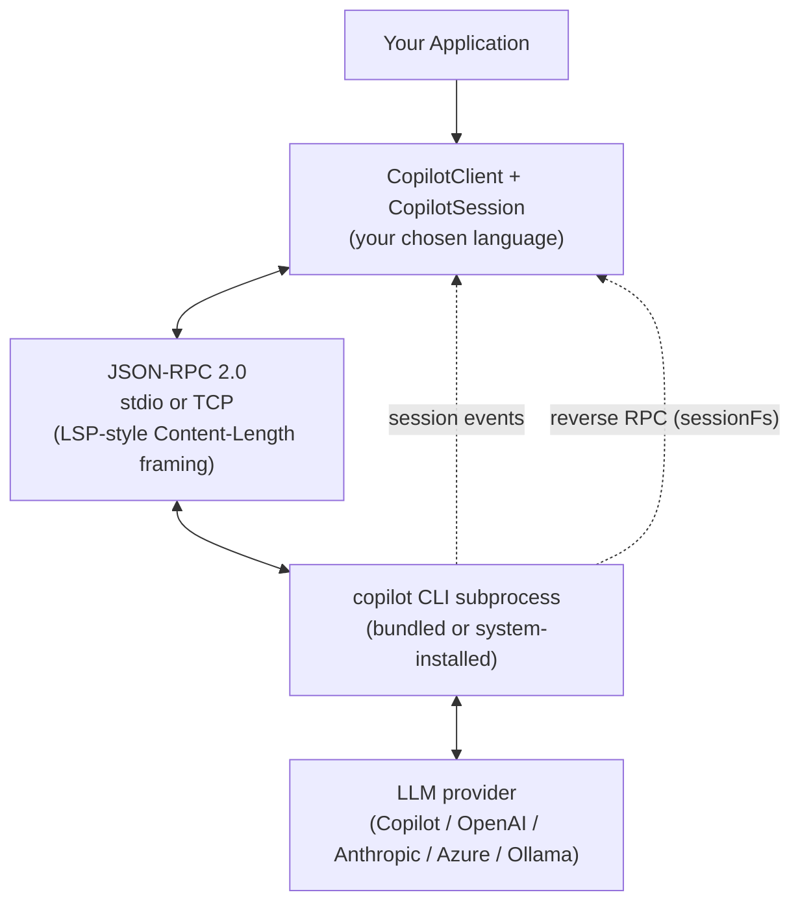
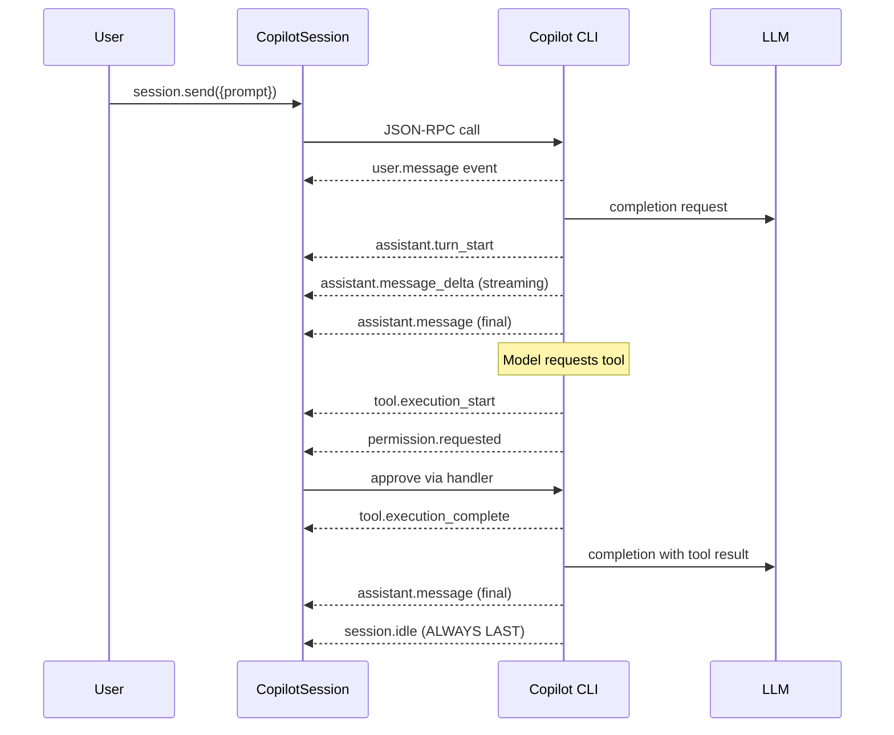
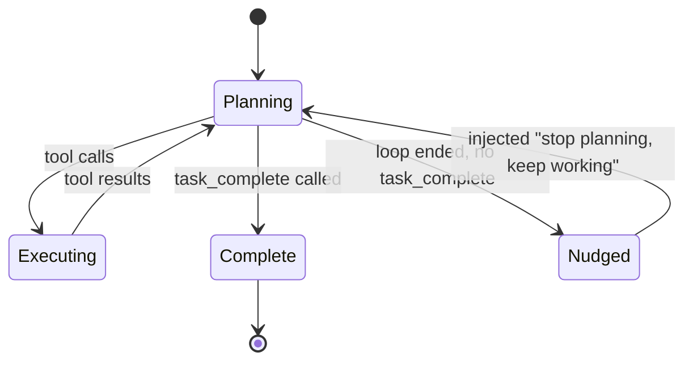

# Architecture

## The harness model

The SDK is a thin, typed orchestration layer over a Copilot CLI subprocess. The CLI owns the agent loop; the SDK owns the wiring.



## Components

### CopilotClient
- Lifecycle manager for the CLI subprocess or external TCP connection
- Handles protocol negotiation (min version 2, current version 3)
- Manages concurrent sessions multiplexed over one JSON-RPC connection
- Holds server-scoped RPC handles (`models.list`, `mcp.*`, `account.getQuota`, etc.)

### CopilotSession
- A single conversation with isolated state
- Holds session-scoped RPC handles (`session.model.*`, `session.mode.*`, etc.)
- Emits typed events (`assistant.message`, `tool.execution_*`, `subagent.*`, etc.)
- Registers handlers for tools, hooks, permissions, user input, elicitation

### Transport
- **stdio**: child process with pipes (default; most common)
- **TCP**: connects to `copilot --headless --port N` server
- **External URL**: `cliUrl` option for pre-running servers
- **Nested**: `isChildProcess: true` for SDK running as a CLI extension

## Three transport modes visualized

### 1. Bundled CLI (stdio)

```
[ Your Process ]
        │  stdin/stdout
        ▼
[ copilot CLI spawned as child ]
        │
        ▼
[ LLM provider ]
```

Used by: desktop apps, CLIs, prototypes. Bundler embeds CLI binary via `go:embed` + zstd compression.

### 2. Headless server (TCP)

```
[ Backend App A ]──┐
[ Backend App B ]──┼──(TCP port 3000)──▶ [ copilot --headless ] ──▶ [ LLM ]
[ Backend App C ]──┘
```

Used by: web backends, microservices. Supports multi-user shared servers with per-user `configDir` isolation.

### 3. Container proxy

```
[ Your App ]
     │ TCP
     ▼
[ copilot in Docker container ]
     │ HTTP (intercepted)
     ▼
[ Proxy on host, injects API keys ]
     │
     ▼
[ LLM provider ]
```

Used when secrets must never enter the container. Safe-to-share, safe-to-scan images.

## Session event stream

Every session emits a well-ordered stream of events. The contract:



**Ordering invariants (strictly tested):**
- `session.idle` is always the last event in a send cycle
- `assistant.message_delta` always precedes `assistant.message`
- `tool.execution_complete.toolCallId` correlates with `tool.execution_start.toolCallId`
- Every event has non-empty `id` and ISO-8601 `timestamp`

## Session modes

Three modes, switchable at runtime via `session.mode.set`:

| Mode | Behavior | Use case |
|---|---|---|
| `interactive` | Default; waits for user input between turns | IDE plugins, chat UIs |
| `plan` | Generates plan, awaits approval via `exit_plan_mode.requested` | Risk-sensitive workflows |
| `autopilot` | Fully autonomous; CLI nudges model until `task_complete` | Dark factory, batch processing |

## The autopilot enforcement loop

This is the key to unattended operation:



If the agent "stops" without calling `task_complete`, the CLI auto-injects a synthetic user message (`"You have not yet marked the task as complete..."`) and restarts the loop. This means you do not need retry logic around the model deciding to give up.

## What the SDK does NOT do

- **No reconnect/retry in transport.** If the CLI subprocess dies, all pending RPC calls fail. Higher layers must handle recovery.
- **No model hosting.** The SDK always needs a CLI binary somewhere (bundled, path, or remote TCP).
- **No rate limiting.** Quota is enforced server-side; the SDK exposes `account.getQuota` for observability.
- **No state synchronization across clients.** Multiple SDK instances connecting to the same session get a best-effort shared view; updates broadcast but ordering is per-client.

## Protocol versioning

Current protocol: **v3** (as of SDK 0.2.x, ~March 2026).

Version differences:
- **v2**: Single-client permissions; `no-result` permission result not supported
- **v3**: Multi-client tool/permission broadcasts; `capabilities.changed` events; new experimental APIs

The SDK negotiates version on `start()` via `verifyProtocolVersion()`. Minimum supported is v2.

## Where this lives in the code

| Concept | Code location |
|---|---|
| Client | `nodejs/src/client.ts`, `go/client.go`, `python/copilot/client.py`, `dotnet/src/Client.cs` |
| Session | `nodejs/src/session.ts`, `go/session.go`, `python/copilot/session.py` |
| Transport | `go/internal/jsonrpc2/` — LSP-style framing + JSON-RPC 2.0 |
| Generated protocol | `go/rpc/generated_rpc.go`, `nodejs/src/generated/rpc.ts`, `dotnet/src/Generated/` |
| Bundler | `go/cmd/bundler/main.go`, `go/embeddedcli/installer.go` |
| Extension helper | `nodejs/src/extension.ts` (`joinSession` for CLI extensions) |

## Next

- [capability-map.md](capability-map.md) — full list of what the SDK can do
- [../02-core-concepts/sessions.md](../02-core-concepts/sessions.md) — session lifecycle in depth
- [../07-internals/transport-and-protocol.md](../07-internals/transport-and-protocol.md) — wire format details
