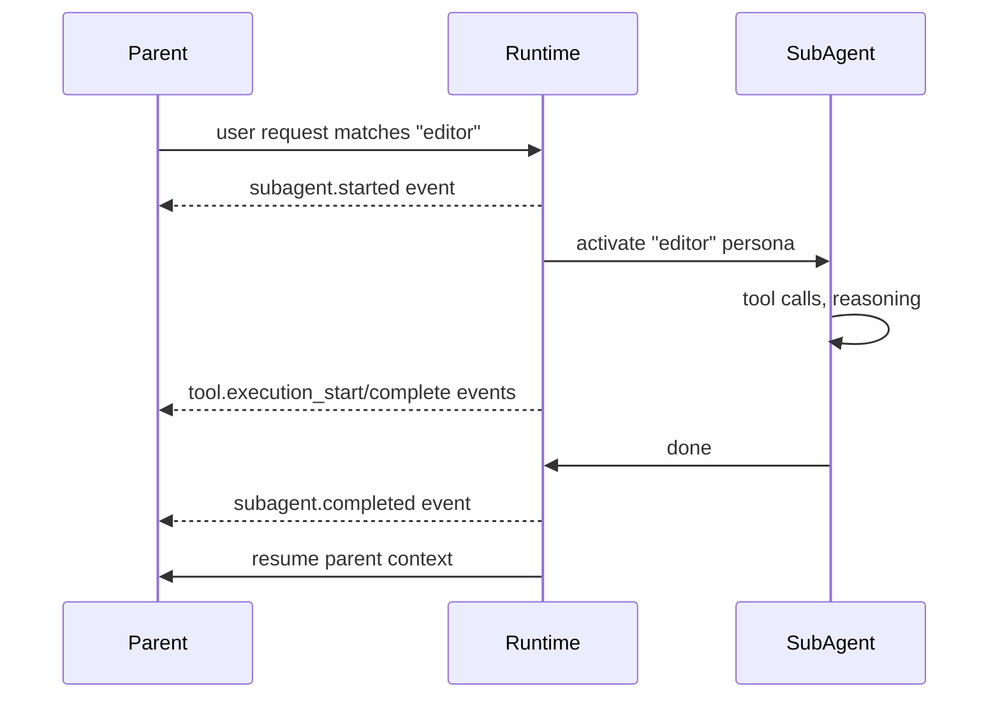

# Agents and Sub-agents

## The core misconception

> "Sub-agents in the Copilot SDK are separate processes / spawned agents."

**This is wrong.** In the Copilot SDK, custom agents are **runtime persona switches within a single session**. They have their own tool whitelists, system prompts, and (optional) MCP servers — but they run in the same CLI process, same session, same event stream.

The Copilot runtime decides — based on the user's request — which agent is "active." Events that look like sub-agent spawning (`subagent.started`, `subagent.completed`) are just lifecycle markers for these runtime role switches, **not** process spawns.

## When you want true independent agents

Spawn multiple `createSession()` calls. Each session has independent context, independent history, and (if on a shared CLI) is fully isolated. See [sessions.md](sessions.md).

## Custom agent definition

```typescript
interface CustomAgentConfig {
  name: string;                             // internal ID, e.g. "researcher"
  displayName?: string;                     // "Research Agent" (for UI)
  description?: string;                     // human-readable purpose
  tools?: string[] | null;                  // whitelist; null = all tools
  prompt: string;                           // agent-specific system prompt
  mcpServers?: Record<string, MCPServerConfig>;  // per-agent MCP
  infer?: boolean;                          // auto-select when request matches
  skills?: string[];                        // skills to preload
}
```

## Typical usage

```typescript
const session = await client.createSession({
  onPermissionRequest: approveAll,
  customAgents: [
    {
      name: "researcher",
      displayName: "Research Agent",
      description: "Analyzes code, answers questions, never modifies files",
      tools: ["grep", "glob", "view"],
      prompt: "You are a read-only research assistant. You never modify files.",
      infer: true,
    },
    {
      name: "editor",
      displayName: "Editor Agent",
      description: "Makes surgical code changes",
      tools: ["view", "edit", "bash"],
      prompt: "You are a code editor. Make minimal, targeted changes.",
      infer: true,
    },
    {
      name: "verifier",
      displayName: "Verification Agent",
      description: "Runs tests and verifies correctness",
      tools: ["bash", "view"],
      prompt: "You run tests and verify correctness. Report failures clearly.",
      infer: true,
    },
  ],
});
```

## Activating an agent

### Auto-inference (preferred)

When `infer: true`, the runtime matches the user's request against agent descriptions and activates the best fit. No explicit routing code required.

### Explicit pre-selection

```typescript
await client.createSession({
  customAgents: [researcher, editor],
  agent: "researcher",   // start active
});
```

### Manual switching at runtime

```typescript
await session.rpc.agent.select({ name: "editor" });
```

Emits `subagent.selected` event to all connected clients.

## The sub-agent event stream

When the runtime delegates work to a custom agent, you get these events:



## Sub-agent event payloads

### `subagent.started`

```typescript
{
  toolCallId: string,         // parent tool invocation ID
  agentName: string,
  agentDisplayName: string,
  agentDescription: string,
}
```

### `subagent.completed`

```typescript
{
  toolCallId: string,
  agentName: string,
  agentDisplayName: string,
  model?: string,             // model used (may differ from parent)
  totalToolCalls?: number,    // tools invoked by sub-agent
  totalTokens?: number,       // tokens consumed
  durationMs?: number,        // wall-clock duration
}
```

### `subagent.failed`

```typescript
{
  toolCallId: string,
  agentName: string,
  agentDisplayName: string,
  error: string,              // error message (required)
  model?: string,
  totalToolCalls?: number,
  totalTokens?: number,
  durationMs?: number,
}
```

### `subagent.selected` / `subagent.deselected`

```typescript
// selected
{
  agentName: string,
  agentDisplayName: string,
  tools: string[] | null,    // tools available to this agent
}

// deselected: same payload
```

## Agent management RPC (experimental)

Available via `session.rpc.agent.*`:

| Method | Purpose |
|---|---|
| `list()` | Get all registered agents |
| `getCurrent()` | Get currently active agent |
| `select({ name })` | Switch to an agent |
| `deselect()` | Clear active agent |
| `reload()` | Re-read agent definitions from disk |

## Streaming sub-agent internals

Sub-agents emit their own tool execution and reasoning events. To include them in your event stream:

```typescript
const session = await client.createSession({
  ...,
  includeSubAgentStreamingEvents: true,   // as of commit 922959f
});
```

Without this flag, you only see the aggregate start/complete events, not the inner tool calls. Useful for debugging; noisy in production.

## Auto-selection heuristics

The Copilot runtime uses the agent's `description` field (plus `prompt` if needed) to decide which agent to route to. Empirical observations:

- Strong verbs in descriptions matter ("analyzes", "modifies", "tests")
- Specific tool lists help the router avoid wasted calls
- `infer: false` makes an agent available only via explicit `agent.select()`

For deterministic routing in dark factory deployments, set `infer: false` on all agents and do explicit `agent.select()` calls from your orchestrator.

## Agent composition patterns

### Specialist pipeline

```
user prompt → researcher (read-only) → editor (write) → verifier (test) → task_complete
```

### Gatekeeper pattern

```
user prompt → gatekeeper (asks clarifying Qs, plans) → executor (does the work)
```

### Tool-scoped safety

- `read-only` agent: only `grep`, `glob`, `view`
- `write` agent: `edit`, `create_file` but NOT `bash`
- `exec` agent: only `bash` for running tests

This gives you fine-grained permission separation without writing a permission handler.

## Comparison with true sub-agents

| Feature | Custom agents | True multi-process agents (concurrent sessions) |
|---|---|---|
| Isolation | Same process, shared event stream | Separate sessions, optionally separate CLI |
| Context | Shared conversation history | Independent histories |
| Overhead | Near-zero (persona switch) | Full session creation |
| Routing | Automatic (via `infer`) | Manual (you orchestrate) |
| Use case | Role separation within one task | Parallel task execution |

## Fleet mode (experimental)

`session.fleet.start()` is a separate experimental API for genuine multi-agent orchestration. See [../04-advanced/session-fork-and-fleet.md](../04-advanced/session-fork-and-fleet.md).

## See also

- [sessions.md](sessions.md) — sessions hold the agents
- [tools-and-mcp.md](tools-and-mcp.md) — per-agent tool whitelists
- [../04-advanced/session-modes.md](../04-advanced/session-modes.md) — interactive/plan/autopilot
- [../04-advanced/session-fork-and-fleet.md](../04-advanced/session-fork-and-fleet.md) — fleet experimental API
- [../06-dark-factory/blueprint.md](../06-dark-factory/blueprint.md) — combining agents for autonomy
