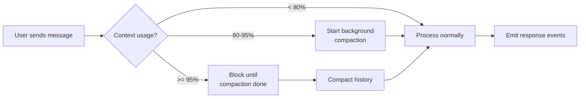

# Infinite Sessions and Compaction

## The problem

Every LLM has a context window. Long conversations fill it, hit the ceiling, and the session dies.

## The SDK's answer

**Infinite sessions with automatic compaction.** When enabled (default), the CLI monitors context usage and compacts older messages in the background before they overflow.

## Configuration

```typescript
await client.createSession({
  infiniteSessions: {
    enabled: true,                             // default: true
    backgroundCompactionThreshold: 0.80,       // start async compaction at 80%
    bufferExhaustionThreshold: 0.95,           // block and compact at 95%
  },
});
```

## How it works



## Two thresholds

| Threshold | Default | When to tune |
|---|---|---|
| `backgroundCompactionThreshold` | 0.80 | Lower if you want earlier, smoother compaction |
| `bufferExhaustionThreshold` | 0.95 | Lower for safer margin (but more latency) |

**Rule of thumb:** keep `bufferExhaustionThreshold - backgroundCompactionThreshold >= 0.10` to give background compaction enough runway.

## Workspace persistence

When `infiniteSessions.enabled: true`, sessions get a `workspacePath`:

```typescript
console.log(session.workspacePath);
// e.g., "/var/copilot/sessions/<sessionId>"
```

Contents:
```
<workspacePath>/
├── checkpoints/       # periodic state snapshots
├── plan.md            # if in plan mode
├── files/             # session-scoped artifacts
└── events.jsonl       # persisted event log
```

This is what survives across process restarts. `resumeSession(sessionId)` rebuilds state from this directory.

## Events you care about

```typescript
session.on("session.compaction_start", (e) => {
  console.log("Compacting...");
});

session.on("session.compaction_complete", (e) => {
  // e.data.tokensRemoved, e.data.messagesRemoved, e.data.contextWindow
  metrics.recordCompaction(e.data);
});

session.on("session.usage_info", (e) => {
  // ephemeral; current context window utilization
  // useful for a "context fullness" UI indicator
});
```

## Manual compaction (experimental)

Force compaction at any point:

```typescript
const result = await session.rpc.history.compact();
// {
//   success: boolean,
//   tokensRemoved: number,
//   messagesRemoved: number,
//   contextWindow: { before, after, model_limit },
// }
```

Useful when you know you're about to dump a large tool result.

## Manual truncation (experimental)

Drop history up to a specific event:

```typescript
const result = await session.rpc.history.truncate({
  eventId: "event_xyz",   // truncate everything BEFORE this event
});
// { eventsRemoved: number }
```

**Warning:** truncation is destructive. Events are gone. Don't use this to "undo" a bad turn — use `sessions.fork` instead.

## What gets compacted

The CLI summarizes older turns while preserving:
- Current task context
- Recent tool results
- Active plan state
- Pinned / marked important messages (if any)

The exact algorithm is server-side and not part of the SDK contract. Treat it as a black box that preserves task continuity.

## Model switching to extend context

If you're hitting limits with one model, switch to one with a larger context window mid-session:

```typescript
await session.rpc.model.switchTo({
  modelId: "claude-sonnet-4.5",   // 200k context
  modelCapabilities: {
    limits: { max_context_window_tokens: 200000 },
  },
});
```

This emits `session.model_change` but does NOT trigger compaction — the new, larger window absorbs the existing history.

## Session FS for very long sessions

If your sessions are truly long-lived (hours, days), combine infinite sessions with a remote session filesystem so the `workspacePath` state isn't local:

```typescript
const client = new CopilotClient({
  sessionFs: yourRemoteFsHandler,   // S3, R2, Postgres BYTEA, ...
});
```

See [../04-advanced/session-filesystem-provider.md](../04-advanced/session-filesystem-provider.md).

## When to disable infinite sessions

```typescript
infiniteSessions: { enabled: false }
```

Reasons to disable:
- You control session length tightly (< 10 turns) and don't want the overhead
- You're running ephemeral sessions where restart is cheaper than compaction
- You're debugging and want to see the raw, uncompacted history

Most production deployments want it on.

## Gotchas

1. **`workspacePath` is only set when `infiniteSessions.enabled: true`.** Ephemeral sessions have no workspace.
2. **Compaction is not deterministic.** Two identical sessions may compact differently based on model choice, thresholds, and timing.
3. **Compaction takes tokens too.** The compaction call itself consumes input tokens (summarization is an LLM call). Factor this into cost estimates.
4. **Background compaction can fail silently.** If a compaction errors, the session continues; on next message the `bufferExhaustionThreshold` may hard-block. Monitor `session.error` events.
5. **Manual compaction / truncation are experimental.** APIs may change; annotate with `@experimental` in codebases.

## See also

- [sessions.md](sessions.md) — session lifecycle
- [../04-advanced/hidden-rpc-methods.md](../04-advanced/hidden-rpc-methods.md) — `session.history.*`, `session.usage.*`
- [../04-advanced/session-filesystem-provider.md](../04-advanced/session-filesystem-provider.md) — remote workspace storage
- [../06-dark-factory/blueprint.md](../06-dark-factory/blueprint.md) — using infinite sessions for unattended work
