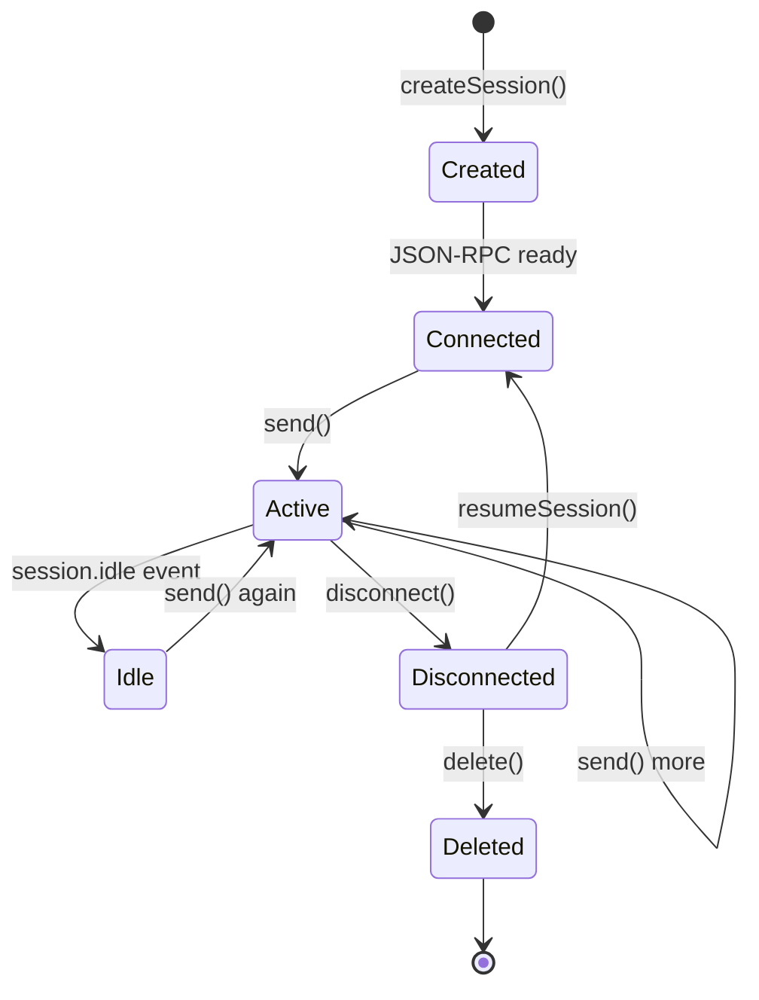

# Sessions

A session is a single conversation with isolated state. Everything interesting happens inside one.

## Session types

| Type | Persistence | Use case |
|---|---|---|
| **Ephemeral** | None (in-memory only) | Fire-and-forget, quick queries |
| **Persistent / Resumable** | Disk (via explicit `sessionId`) | Multi-step tasks, crash recovery |
| **Concurrent** | Per-session isolated state | Multiple parallel tasks on one client |
| **Shared (multi-client)** | Disk, per-user `configDir` | SaaS multi-tenancy |
| **Forked** | Disk copy of parent up to `toEventId` | A/B testing, safe rollback (experimental) |

## Lifecycle



## Creating a session

### Ephemeral (most common for prototypes)

```typescript
const session = await client.createSession({
  model: "gpt-5",
  onPermissionRequest: approveAll,
});
```

### Persistent (survives process restart)

```typescript
const session = await client.createSession({
  sessionId: "user-123-epic-42",   // explicit ID = enables disk persistence
  model: "gpt-5",
  onPermissionRequest: approveAll,
});
```

### With full configuration

```typescript
const session = await client.createSession({
  sessionId: "my-session",
  model: "gpt-5",
  agent: "researcher",                    // preselect a custom agent
  tools: [myCustomTool],
  mcpServers: { "my-mcp": {...} },
  customAgents: [agent1, agent2],
  systemMessage: { mode: "customize", sections: {...} },
  infiniteSessions: {
    enabled: true,
    backgroundCompactionThreshold: 0.80,
    bufferExhaustionThreshold: 0.95,
  },
  streaming: true,
  hooks: { onPreToolUse: ..., onPostToolUse: ... },
  onPermissionRequest: async (req) => ({ kind: "approved" }),
  onUserInputRequest: async (req) => ({ answer: "yes" }),
  onElicitationRequest: async (ctx) => ({ action: "accept", content: {} }),
  enableConfigDiscovery: true,  // auto-discover .mcp.json, skills (v0.2.2+)
});
```

## Resuming

```typescript
const session = await client.resumeSession("user-123-epic-42", {
  onPermissionRequest: approveAll,
  // tools, hooks, etc. must be reprovided — they are not persisted
});
```

Handlers (`onPermissionRequest`, `onUserInputRequest`, etc.) are **not** part of persistent state. You must reprovide them on every resume.

State that IS persisted:
- Conversation history (user + assistant messages, tool calls, tool results)
- Active custom agent selection
- Plan file (if in plan mode)
- Session workspace files (checkpoints, artifacts)
- Infinite session compaction state

## Disconnect vs delete

```typescript
await session.disconnect();  // free in-memory resources; session data survives on disk
await session.delete();      // permanent removal from disk — irreversible
```

Use `disconnect()` by default. Only `delete()` when you want to guarantee the session is gone (compliance, user-requested data removal).

## Concurrent sessions on one client

```typescript
const [s1, s2, s3] = await Promise.all([
  client.createSession({ ... }),
  client.createSession({ ... }),
  client.createSession({ ... }),
]);

// Each has independent state, tools, hooks, event handlers
// All multiplexed over one JSON-RPC connection to one CLI subprocess
```

Limits: shared CLI process has one event loop, so concurrent tool execution may queue. For heavy parallelism, use multiple `CopilotClient` instances (one per CLI subprocess).

## Sharing a session across clients

Multi-user patterns use a **headless** CLI:

```bash
copilot --headless --port 3000
```

Then:

```typescript
// User A, Client 1 — creates the session
const clientA = new CopilotClient({ cliUrl: "http://localhost:3000", configDir: "/var/users/alice" });
await clientA.createSession({ sessionId: "shared-123", ... });

// User A, Client 2 — resumes same session from different process
const clientA2 = new CopilotClient({ cliUrl: "http://localhost:3000", configDir: "/var/users/alice" });
await clientA2.resumeSession("shared-123", {...});
```

Per-user isolation comes from `configDir`; session isolation comes from unique `sessionId`.

## Session events you care about

| Event | When | Payload |
|---|---|---|
| `session.start` | On create | start metadata |
| `session.resume` | On resume | resume context |
| `session.idle` | After every send cycle completes | — (always last event in cycle) |
| `session.task_complete` | Model called `task_complete` tool | `{ summary?: string }` |
| `session.compaction_start/complete` | Context compaction | token counts |
| `session.error` | Runtime error | `{ error, errorContext, recoverable }` |
| `session.model_change` | Model switched | `{ previousModel, newModel }` |
| `session.mode_changed` | Mode switched | `{ mode }` |
| `session.plan_changed` | Plan file modified | `{ action: "create"|"update"|"delete" }` |
| `capabilities.changed` | Client joined/left | `{ ui: { elicitation: bool } }` |
| `session.shutdown` | Session ending | usage metrics |

See [../08-reference/event-types.md](../08-reference/event-types.md) for the complete list.

## `session.idle` vs `session.task_complete`

This trips people up:

| | `session.idle` | `session.task_complete` |
|---|---|---|
| Meaning | Agent stopped processing, ready for next input | Task is fulfilled |
| Fires | Always, after every send cycle | Only when model calls `task_complete` tool |
| Persistence | Ephemeral (not saved to disk) | Persisted |
| In autopilot | Fires, but CLI will nudge agent to keep going if no `task_complete` | Only signal that stops the autopilot loop |
| Use for | Knowing agent is no longer streaming | Knowing the job is done |

## Metadata without loading

```typescript
const meta = await client.getSessionMetadata("user-123-epic-42");
// { id, createdAt, updatedAt, model, title, ... }
```

Available since SDK v0.2.1. Lets you enumerate sessions without paying to fully resume each one.

## Usage metrics

```typescript
const metrics = await session.rpc.usage.getMetrics();
// {
//   totalPremiumRequestCost,
//   totalUserRequests,
//   totalApiDurationMs,
//   sessionStartTime,
//   codeChanges,
//   modelMetrics: { "gpt-5": { ... }, "claude-sonnet": { ... } },
//   currentModel,
//   lastCallInputTokens,
//   lastCallOutputTokens,
// }
```

Experimental API. Critical for cost monitoring in dark factory deployments.

## Gotchas

1. **Handlers are not persisted.** You must provide `onPermissionRequest` on every resume.
2. **SessionFS config must happen before first session.** `sessionFs.setProvider` fails if sessions already exist.
3. **Deleted sessions can't be recovered.** No soft-delete — use `disconnect()` unless you really mean it.
4. **Session metadata uses `configDir` for lookup.** Resuming requires the same `configDir` used on create.
5. **Multiple concurrent resumes of the same session are undefined behavior.** Use one live client per session ID.

## See also

- [agents-and-subagents.md](agents-and-subagents.md) — custom agents within a session
- [infinite-sessions-and-compaction.md](infinite-sessions-and-compaction.md) — long-running sessions
- [../04-advanced/session-fork-and-fleet.md](../04-advanced/session-fork-and-fleet.md) — branching sessions
- [../04-advanced/session-filesystem-provider.md](../04-advanced/session-filesystem-provider.md) — virtual FS
