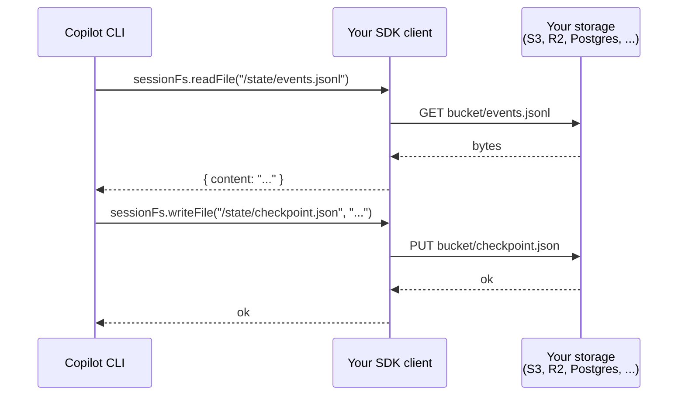

# Session Filesystem Provider

The mechanism that makes cloud/serverless deployments possible. Routes all session file I/O through your code instead of the local disk.

## The concept

Normally, when the Copilot CLI needs to read or write a file (tool output, checkpoint, plan, etc.), it hits the local filesystem. In serverless/container deployments, this is a problem: ephemeral disks, multi-tenant safety, no persistent state.

The session filesystem provider inverts control: **the server calls your SDK client for every file operation**. You decide where the bytes actually go.



## This is reverse RPC

Unlike normal RPCs (client → server), sessionFs methods go server → client. The Copilot CLI is asking YOUR code for data.

## The handler interface

All SDKs expose a handler you implement:

### Node.js

```typescript
const client = new CopilotClient({
  sessionFs: {
    initialCwd: "/virtual",
    sessionStatePath: "/virtual/state",
    conventions: "posix",
  },
});

const session = await client.createSession({
  createSessionFsHandler: (sessionId) => ({
    readFile: async ({ path }) => ({
      content: await storage.get(`${sessionId}${path}`),
    }),
    writeFile: async ({ path, content }) => {
      await storage.put(`${sessionId}${path}`, content);
    },
    appendFile: async ({ path, content }) => {
      await storage.append(`${sessionId}${path}`, content);
    },
    exists: async ({ path }) => ({
      exists: await storage.exists(`${sessionId}${path}`),
    }),
    stat: async ({ path }) => ({
      stats: await storage.stat(`${sessionId}${path}`),
    }),
    mkdir: async ({ path }) => {
      await storage.mkdir(`${sessionId}${path}`);
    },
    readdir: async ({ path }) => ({
      entries: await storage.list(`${sessionId}${path}`),
    }),
    readdirWithTypes: async ({ path }) => ({
      entries: await storage.listWithTypes(`${sessionId}${path}`),
    }),
    rm: async ({ path, recursive }) => {
      await storage.delete(`${sessionId}${path}`, recursive);
    },
    rename: async ({ oldPath, newPath }) => {
      await storage.rename(`${sessionId}${oldPath}`, `${sessionId}${newPath}`);
    },
  }),
  onPermissionRequest: approveAll,
});
```

### .NET

```csharp
public class MyFsHandler : ISessionFsHandler
{
    public Task<SessionFsReadFileResult> ReadFileAsync(SessionFsReadFileRequest req) { ... }
    public Task WriteFileAsync(SessionFsWriteFileRequest req) { ... }
    public Task AppendFileAsync(SessionFsAppendFileRequest req) { ... }
    public Task<SessionFsExistsResult> ExistsAsync(SessionFsExistsRequest req) { ... }
    public Task<SessionFsStatResult> StatAsync(SessionFsStatRequest req) { ... }
    public Task MkdirAsync(SessionFsMkdirRequest req) { ... }
    public Task<SessionFsReaddirResult> ReaddirAsync(SessionFsReaddirRequest req) { ... }
    public Task<SessionFsReaddirWithTypesResult> ReaddirWithTypesAsync(SessionFsReaddirWithTypesRequest req) { ... }
    public Task RmAsync(SessionFsRmRequest req) { ... }
    public Task RenameAsync(SessionFsRenameRequest req) { ... }
}
```

## Initial configuration

```typescript
{
  sessionFs: {
    initialCwd: "/virtual",              // CWD the agent sees
    sessionStatePath: "/virtual/state",  // where session state lives (events, checkpoints)
    conventions: "posix",                // or "windows" — affects path separators
  }
}
```

## The session state path

Everything the session persists flows through `sessionStatePath`:

```
{sessionStatePath}/
├── events.jsonl          # persisted event log
├── checkpoints/          # periodic snapshots
├── plan.md              # plan mode state
├── temp/                # large tool outputs redirected here
└── files/               # session-scoped artifacts
```

So implementing the handler gives you a single pluggable point for all session data.

## Storage backend patterns

### In-memory (for tests)

```typescript
import { MemoryProvider } from "@platformatic/vfs";

const mem = new MemoryProvider();
createSessionFsHandler: () => memToHandler(mem);
```

Used extensively in the SDK's own tests (`nodejs/test/e2e/session_fs.test.ts`).

### S3 / R2

```typescript
createSessionFsHandler: (sessionId) => ({
  readFile: async ({ path }) => {
    const res = await s3.send(new GetObjectCommand({
      Bucket: "copilot-sessions",
      Key: `${sessionId}${path}`,
    }));
    return { content: await streamToString(res.Body) };
  },
  writeFile: async ({ path, content }) => {
    await s3.send(new PutObjectCommand({
      Bucket: "copilot-sessions",
      Key: `${sessionId}${path}`,
      Body: content,
    }));
  },
  // ...
});
```

### Postgres bytea

```typescript
createSessionFsHandler: (sessionId) => ({
  readFile: async ({ path }) => {
    const { rows } = await db.query(
      "SELECT content FROM session_files WHERE session_id = $1 AND path = $2",
      [sessionId, path],
    );
    return { content: rows[0].content.toString() };
  },
  writeFile: async ({ path, content }) => {
    await db.query(`
      INSERT INTO session_files (session_id, path, content)
      VALUES ($1, $2, $3)
      ON CONFLICT (session_id, path) DO UPDATE SET content = $3
    `, [sessionId, path, Buffer.from(content)]);
  },
  // ...
});
```

### Redis (for short-lived sessions)

Not recommended for long-term session state (size limits), but fine for ephemeral work.

## Path namespacing

The handler receives session-scoped paths. You decide how to namespace:

```typescript
// Option A: prefix with sessionId
const storageKey = `${sessionId}${path}`;

// Option B: bucket per session
const bucketName = `sessions/${sessionId}`;

// Option C: database row key
const row = { session_id: sessionId, path };
```

## Large output handling

Tool outputs that exceed inline size (~1MB default) are redirected to temp files:
`{sessionStatePath}/temp/tool_<id>_output.txt`

Your handler will get these writes. Make sure your backend handles them (size limits, streaming).

## Constraints

1. **`setProvider` must happen before the first session is created.** Enforced by runtime check; throws if sessions already exist.
2. **All methods must be async.** Even if your backend is sync, return `Promise.resolve()`.
3. **Errors throw.** If a read/write fails, throw from the handler — the error propagates to the agent, which may recover or abort.
4. **Stat must return realistic metadata.** At minimum `isFile`, `isDirectory`, `size`, `mtime`. The agent's behavior can depend on file size.
5. **No caching layer.** Every operation hits your handler. If that's expensive, add your own cache inside the handler.

## Testing with MemoryProvider (Node.js)

The SDK's own tests use `@platformatic/vfs` `MemoryProvider`:

```typescript
import { MemoryProvider } from "@platformatic/vfs";

const mem = new MemoryProvider();
const sp = (sessionId: string, p: string) => `/${sessionId}${p}`;

createSessionFsHandler: (sessionId) => ({
  readFile: async ({ path }) => ({
    content: await mem.readFile(sp(sessionId, path), "utf8"),
  }),
  writeFile: async ({ path, content }) => {
    await mem.writeFile(sp(sessionId, path), content);
  },
  // ...
});
```

See `nodejs/test/e2e/session_fs.test.ts` for full reference.

## Implications for the dark factory

Session FS is the **keystone** of a scalable dark factory:

- **Serverless**: Run Copilot agents in Lambda/Cloud Run with zero local disk
- **Multi-tenant**: Each user's session data namespaced in your own storage
- **Migratable**: Move a session between regions/datacenters by copying storage rows
- **Auditable**: Every file op routes through your code — log everything

Combined with:
- `sessions.fork` for branching without local disk duplication
- `infiniteSessions` for long-running jobs
- `customAgents` for role scoping

...this gives you a cloud-native, cost-observable, auditable agent platform.

## See also

- [hidden-rpc-methods.md](hidden-rpc-methods.md) — complete `sessionFs.*` RPC list
- [../06-dark-factory/blueprint.md](../06-dark-factory/blueprint.md) — full pattern
- [../02-core-concepts/infinite-sessions-and-compaction.md](../02-core-concepts/infinite-sessions-and-compaction.md) — workspace and compaction
