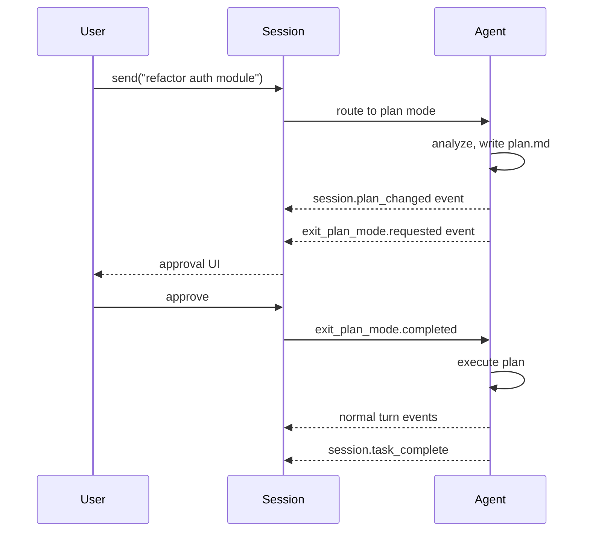
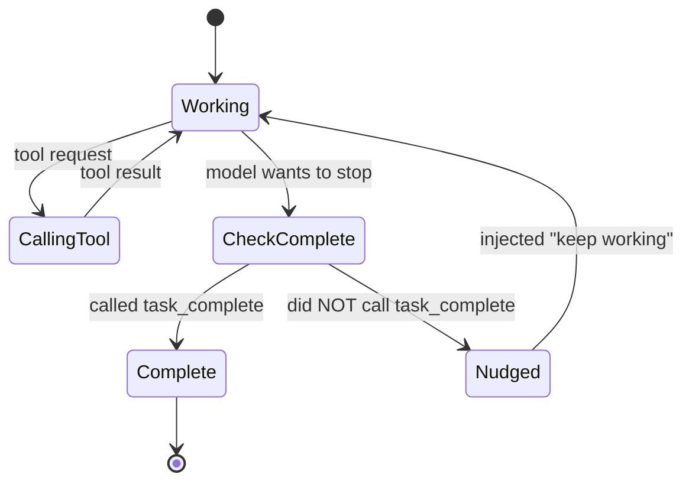

# Session Modes

Three modes control how autonomously the agent operates. Switchable at runtime.

| Mode | Description | Human approval |
|---|---|---|
| `interactive` | Default; waits for user input between turns | Yes, every prompt |
| `plan` | Generates a plan, awaits approval before executing | Yes, once per plan |
| `autopilot` | Fully autonomous until `task_complete` called | No |

## Setting the mode

### At creation (not directly — via session config)

```typescript
// There's no direct `mode` parameter in createSession
// Start the session, then set the mode explicitly:
const session = await client.createSession({...});
await session.rpc.mode.set({ mode: "autopilot" });
```

### At runtime

```typescript
const current = await session.rpc.mode.get();
// { mode: "interactive" | "plan" | "autopilot" }

await session.rpc.mode.set({ mode: "autopilot" });
// emits session.mode_changed event
```

## Interactive mode

Default. The agent streams responses, and the session returns to idle after each prompt. Your code is responsible for driving the next turn.

```typescript
await session.rpc.mode.set({ mode: "interactive" });
await session.sendAndWait({ prompt: "Analyze main.ts" });
// Agent responds, session goes idle
// You decide what to send next
```

Use for: IDE plugins, chat UIs, anything with a human in the loop.

## Plan mode

The agent first generates a plan (stored in `.github/copilot/plan.md`), then emits `exit_plan_mode.requested`. You approve or reject via `exit_plan_mode.completed`.



Approval handler:

```typescript
session.on("exit_plan_mode.requested", async (event) => {
  // event.data.plan: string (the plan content)
  const approved = await userReviews(event.data.plan);

  await session.rpc.plan.exit({
    requestId: event.data.requestId,
    selectedAction: approved ? "approve" : "reject",
    autoApproveEdits: true,        // skip per-edit prompts after approval
    feedback: approved ? undefined : "Please narrower scope",
  });
});
```

## Plan RPC

```typescript
// Read plan file
const plan = await session.rpc.plan.read();
// { exists: boolean, content: string | null, path: string | null }

// Update programmatically
await session.rpc.plan.update({ content: "1. Step one\n2. Step two" });

// Delete
await session.rpc.plan.delete();
```

Plans live at `.github/copilot/plan.md` by convention.

## Autopilot mode

Fully autonomous. The CLI enforces completion via a synthetic nudge.

### The nudge mechanism



When autopilot is on and the agent ends a turn without calling `task_complete`, the CLI injects:

> "You have not yet marked the task as complete using the task_complete tool. If you were planning, stop planning and start implementing."

This continues until the model calls `task_complete`. **You do not need retry logic.**

### Signaling completion

The agent calls the built-in `task_complete` tool with an optional summary:

```json
{
  "tool": "task_complete",
  "arguments": {
    "summary": "Implemented user auth, added tests, all passing."
  }
}
```

Your code listens for the event:

```typescript
session.on("session.task_complete", (event) => {
  console.log("Done:", event.data.summary);
  queue.markCompleted(task);
});
```

### When autopilot is a bad idea

- Untrusted code bases — the agent may take unsafe shortcuts to reach `task_complete`
- Production systems where rollback is expensive
- Environments without sandboxing (autopilot + permissive permissions + shell = destructive)

Mitigate with:
- `customAgents` with tool whitelists (no `bash` for risky tasks)
- `onPreToolUse` hook that blocks destructive patterns
- `sessions.fork()` before each risky step for safe rollback
- Ephemeral working directory with no real data

## Combining modes with fleet

```typescript
// A parent session in interactive mode, that spawns autopilot sub-tasks
await parentSession.rpc.mode.set({ mode: "interactive" });

for (const task of tasks) {
  const child = await client.createSession({
    sessionId: `${task.id}`,
    customAgents: [...],
  });
  await child.rpc.mode.set({ mode: "autopilot" });
  child.on("session.task_complete", () => queue.markDone(task));
  await child.send({ prompt: task.description });
}
```

## Events emitted

| Event | Mode | Payload |
|---|---|---|
| `session.mode_changed` | Any | `{ mode }` |
| `session.plan_changed` | Plan | `{ action: "create"\|"update"\|"delete" }` |
| `exit_plan_mode.requested` | Plan | `{ plan, requestId }` |
| `exit_plan_mode.completed` | Plan | `{ autoApproveEdits, selectedAction, feedback }` |
| `session.task_complete` | Autopilot | `{ summary? }` |

## See also

- [session-fork-and-fleet.md](session-fork-and-fleet.md)
- [hidden-rpc-methods.md](hidden-rpc-methods.md)
- [../06-dark-factory/blueprint.md](../06-dark-factory/blueprint.md)
- [../02-core-concepts/agents-and-subagents.md](../02-core-concepts/agents-and-subagents.md)
