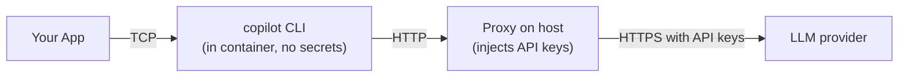
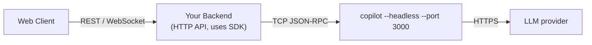

# Deployment Patterns

Four documented deployment architectures, each with different tradeoffs.

## The four patterns

| Pattern | Best for | Transport |
|---|---|---|
| **Fully-bundled** | Desktop apps, CLIs, prototypes | stdio (bundled CLI) |
| **Container-proxy** | Secrets-sensitive containers | TCP + HTTP proxy |
| **App-backend-to-server** | Web APIs, microservices | TCP |
| **App-direct-server** | Direct server consumers | TCP |

Test scenarios for each live under `/test/scenarios/bundling/`.

## 1. Fully-bundled


Single process. SDK spawns the CLI as a child, communicates over stdin/stdout. The CLI binary ships with your app.

### How it's done per language

- **Node.js**: npm peerDep on `@github/copilot`; SDK auto-finds it
- **Python**: pip dep on `github-copilot` package
- **.NET**: NuGet RID-specific bundle (`runtimes/{rid}/native/copilot`)
- **Go**: `go tool bundler` with `go:embed` + zstd compression (see [bundling.md](bundling.md))

### Pros

- Zero configuration for end-users
- No network dependency (besides the LLM)
- Simple process model

### Cons

- Binary size bloat (CLI is ~30-50 MB)
- Version lock-in — updating CLI means releasing a new app version
- No multi-user isolation

### Use when

- Desktop apps
- CI/CD tools
- Single-user CLIs

## 2. Container-proxy



Copilot runs in a container without any credentials. A host-side proxy intercepts outbound HTTP and injects API keys before forwarding to the LLM.

### Setup sketch

```bash
# Host
python proxy.py --port 4000 --api-key $ANTHROPIC_API_KEY

# Container
docker run -p 3000:3000 \
  -e COPILOT_API_URL=http://host.docker.internal:4000 \
  copilot-cli --headless --port 3000
```

### Pros

- **No secrets in the container image** — safe to share, scan, distribute
- **No secrets at runtime inside container** — even compromise doesn't leak tokens
- Container can be cached/warmed without exposing creds

### Cons

- More moving parts (proxy + container)
- Latency overhead of extra hop
- Proxy is a single point of failure

### Use when

- Running agents on shared infra
- Container images might be distributed
- Compliance/audit requirements around secrets

## 3. App-backend-to-server



Your backend exposes a normal HTTP API (Express, FastAPI, Gin, etc.). The SDK is inside your backend, talking TCP to a pre-running `copilot --headless` process.

### Pattern

```typescript
// Backend startup
const client = new CopilotClient({ cliUrl: "tcp://localhost:3000" });
await client.start();

// Per request
app.post("/chat", async (req, res) => {
  const session = await client.createSession({
    sessionId: `user-${req.user.id}-${Date.now()}`,
    onPermissionRequest: approveAll,
  });

  session.on("assistant.message", (e) => {
    res.write(e.data.content);
  });

  await session.sendAndWait({ prompt: req.body.prompt });
  res.end();
});
```

### Pros

- Standard web architecture
- Clients can't reach the CLI directly (security layer)
- Easy to horizontally scale backends (each connects to the shared CLI)

### Cons

- Single headless CLI is a bottleneck for very high concurrency
- Backend must manage session lifecycle correctly
- Need a process supervisor for the headless CLI

### Use when

- Building web apps with AI features
- Microservice architecture
- Multi-client web/mobile apps

## 4. App-direct-server


Like pattern 3 but without the HTTP abstraction. Your app talks directly to the headless CLI over TCP.

### Pattern

```typescript
const client = new CopilotClient({ cliUrl: "tcp://localhost:3000" });
await client.start();
// Use directly
```

### Pros

- Lowest latency for trusted clients
- Simple

### Cons

- No HTTP layer to add auth, rate limiting, etc.
- Assumes trusted network

### Use when

- Internal-only tooling
- Trusted environments
- Development / prototyping against headless servers

## Multi-user patterns

Both pattern 3 and 4 can serve multiple users via:

### Shared CLI with per-user `configDir`

```typescript
// User Alice's backend request
const aliceClient = new CopilotClient({
  cliUrl: "tcp://localhost:3000",
  configDir: "/var/users/alice",
});

// User Bob's backend request
const bobClient = new CopilotClient({
  cliUrl: "tcp://localhost:3000",
  configDir: "/var/users/bob",
});
```

One CLI process, isolated user state. Lighter resource usage.

### One CLI per user (strong isolation)

```typescript
// Spawn a dedicated CLI for each user
const alicePort = 3001;
spawn("copilot", ["--headless", "--port", String(alicePort)]);
const aliceClient = new CopilotClient({ cliUrl: `tcp://localhost:${alicePort}` });

const bobPort = 3002;
// ... etc
```

Heavier on resources but complete process isolation.

See `docs/setup/scaling.md` for the decision matrix.

## Serverless / Lambda / Cloud Run

Not a documented pattern, but feasible with `sessionFs`:

1. Lambda spawns the CLI as a child (bundled pattern)
2. `sessionFs` provider redirects all I/O to S3/DynamoDB
3. Session persistence survives invocations
4. Each invocation resumes by `sessionId`

Caveats:
- Cold start ~2-5s (CLI spawn + first LLM call)
- Lambda execution time limit (15 min) may truncate long tasks — use autopilot with task splitting
- Memory footprint of CLI + model context

## Scaling decision matrix

| Question | Answer | Pattern |
|---|---|---|
| Single user, desktop? | Yes | Fully-bundled |
| Container with no secrets? | Yes | Container-proxy |
| Web app with auth? | Yes | App-backend-to-server |
| Internal tool, trusted network? | Yes | App-direct-server |
| Multi-tenant SaaS? | Yes | App-backend + per-user configDir + `sessionFs` |
| Long-running autonomous jobs? | Yes | App-backend + `sessionFs` + infinite sessions |

## Reference scenarios in this repo

All four patterns have runnable test scenarios:

- `/test/scenarios/bundling/fully-bundled/`
- `/test/scenarios/bundling/container-proxy/`
- `/test/scenarios/bundling/app-backend-to-server/`
- `/test/scenarios/bundling/app-direct-server/`

Each has language variants (TS, Python, Go, C#). Run via:

```bash
just scenario-build
just scenario-verify
```

## See also

- [authentication.md](authentication.md)
- [bundling.md](bundling.md) — Go bundler details
- [../04-advanced/session-filesystem-provider.md](../04-advanced/session-filesystem-provider.md)
- [../02-core-concepts/sessions.md](../02-core-concepts/sessions.md) — multi-user session patterns
