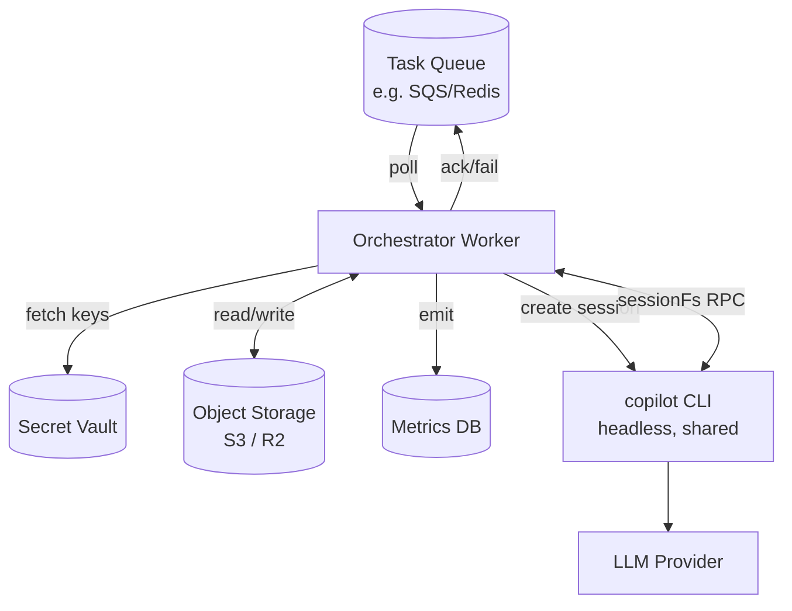

# Dark Factory Blueprint

A "dark factory" is an unattended agent pipeline that processes work items (epics, tasks, tickets) without a human in the loop. This doc is the architecture blueprint — for actual code, see [implementation-guide.md](implementation-guide.md).

## What makes a dark factory possible with this SDK

```
Epic / Task Queue
         │
         ▼
┌────────────────────────────────┐
│   Orchestrator (your code)     │
│   - polls queue                │
│   - creates sessions           │
│   - monitors completion        │
│   - handles failures           │
└─────────────┬──────────────────┘
              │ creates
              ▼
┌────────────────────────────────┐
│  CopilotClient                 │
│  (connects to CLI subprocess)  │
└─────────────┬──────────────────┘
              │ multiplexes
              ▼
┌────────────────────────────────┐
│  Sessions (per task)           │
│  ├─ autopilot mode             │
│  ├─ customAgents (role-scoped) │
│  ├─ infiniteSessions           │
│  └─ sessionFs (virtual FS)     │
└─────────────┬──────────────────┘
              │ reports
              ▼
     session.task_complete
              │
              ▼
       Queue: mark done
```

## The primitives you're assembling

| Primitive | Purpose |
|---|---|
| `mode: "autopilot"` | No plan approval, runs to completion |
| `customAgents` with tool whitelists | Role separation inside the session |
| `infiniteSessions` | No context window ceiling |
| Persistent `sessionId` | Survives crashes; resumable |
| `sessionFs` virtual FS | Zero local disk, cloud-native |
| `sessions.fork` | Safe rollback before risky steps |
| `session.task_complete` event | Reliable completion signal |
| `session.rpc.usage.getMetrics()` | Cost monitoring per task |
| `onPermissionRequest: approveAll` | Autonomous permission approval |
| Autopilot nudge | CLI forces the loop to keep working |

## Reference architecture



Key properties:

- **Storage-first state**: Session state lives in object storage via `sessionFs`
- **Stateless orchestrator workers**: Can scale horizontally, sessions resumable
- **Centralized secrets**: Keys fetched at session creation; never persisted
- **Observable**: Every task gets its own session metrics snapshot

## The five-phase pipeline

### Phase 1: Intake

Parse the epic or task into a session prompt. This is the only place where you exercise judgment about what to tell the agent.

```typescript
function buildPrompt(task: Task): string {
  return `
Task: ${task.title}

Description:
${task.description}

Acceptance criteria:
${task.criteria.map(c => `- ${c}`).join("\n")}

When you believe the task is fulfilled, call the task_complete tool with a summary.
If you cannot fulfill it, call task_complete with a summary explaining why.
`.trim();
}
```

### Phase 2: Session creation

One session per task, with all the primitives wired:

```typescript
const session = await client.createSession({
  sessionId: `task-${task.id}`,
  model: "gpt-5",

  onPermissionRequest: approveAll,

  customAgents: [
    researcherAgent,    // read-only tools
    editorAgent,        // edit tools
    verifierAgent,      // test runner
  ],

  infiniteSessions: {
    enabled: true,
    backgroundCompactionThreshold: 0.75,   // start early
    bufferExhaustionThreshold: 0.90,
  },

  hooks: {
    onErrorOccurred: async (input, inv) => {
      await metrics.recordError(task.id, input);
    },
    onPostToolUse: async (input) => {
      await metrics.recordToolUse(task.id, input.toolName);
    },
  },

  createSessionFsHandler: (sid) => yourStorageHandler(sid),
});

// Enter autopilot after setup
await session.rpc.mode.set({ mode: "autopilot" });
```

### Phase 3: Execution and monitoring

Start the task, register listeners, wait for completion:

```typescript
const done = new Promise<TaskResult>((resolve) => {
  session.on("session.task_complete", (e) => {
    resolve({ status: "done", summary: e.data.summary });
  });

  session.on("session.error", async (e) => {
    if (!e.data.recoverable) {
      resolve({ status: "failed", error: e.data.error });
    }
  });

  session.on("subagent.completed", (e) => {
    metrics.recordSubagent(task.id, e.data);
  });
});

await session.send({ prompt: buildPrompt(task) });
const result = await done;
```

### Phase 4: Verification and reporting

Before marking done, verify the outcome (tests pass, artifacts exist, etc.):

```typescript
if (result.status === "done") {
  const testOutput = await session.rpc.shell.run({
    command: "npm test",
    cwd: "/work",
    timeout: 60000,
  });
  // inspect output, decide whether to accept
}

const metrics = await session.rpc.usage.getMetrics();
await recordCost(task.id, metrics);
```

### Phase 5: Cleanup and next

```typescript
if (result.status === "done") {
  await queue.ack(task);
  await session.disconnect();
  // Optional: session.delete() to free storage immediately
} else {
  await queue.nack(task, result.error);
  await session.disconnect();
  // Session preserved on disk for debugging
}
```

## Handling failures

### Recoverable failures (resume)

```typescript
async function processTask(task: Task) {
  try {
    await runTask(task);
  } catch (err) {
    if (isTransient(err)) {
      // Resume instead of retry from scratch
      const session = await client.resumeSession(`task-${task.id}`, {...});
      await session.send({ prompt: "continue where you left off" });
    } else {
      await queue.moveToDLQ(task, err);
    }
  }
}
```

### Unrecoverable failures (DLQ)

Move to dead-letter queue for human review. Don't keep retrying indefinitely.

### Session FS as persistence layer

Because all state is in `sessionFs`, a crashed orchestrator worker can be replaced and resumed without data loss:

```
Worker 1 starts task-123 → crashes mid-session
Worker 2 picks up task-123 → resumeSession("task-123") → continues
```

## Safety guardrails

### Tool-scoped agents (no `bash` where not needed)

```typescript
const researcherAgent = {
  name: "researcher",
  tools: ["grep", "glob", "view"],   // read-only
  prompt: "You are a researcher. You only read, never write.",
};
```

### Pre-flight fork before risky steps

```typescript
// Before a potentially destructive step
const backup = await client.rpc.sessions.fork({
  sessionId: session.sessionId,
});

try {
  await runDestructiveStep(session);
} catch (err) {
  // Roll back to backup
  await session.delete();
  session = await client.resumeSession(backup.sessionId, {...});
}
```

### Hook-level policy enforcement

```typescript
hooks: {
  onPreToolUse: async (input) => {
    if (input.toolName === "bash") {
      if (isDangerousCommand(input.arguments.command)) {
        return { permissionDecision: "deny", reason: "Blocked by policy" };
      }
    }
  },
}
```

### Timeout on task completion

Don't let a session run forever:

```typescript
const timeout = new Promise<TaskResult>((_, reject) =>
  setTimeout(() => reject(new Error("task timeout")), 30 * 60 * 1000),
);

const result = await Promise.race([done, timeout]);
```

## Cost control

### Per-task metrics

```typescript
session.on("session.task_complete", async () => {
  const metrics = await session.rpc.usage.getMetrics();

  await db.recordTaskCost({
    taskId: task.id,
    cost: metrics.totalPremiumRequestCost,
    tokens: metrics.lastCallInputTokens + metrics.lastCallOutputTokens,
    apiDurationMs: metrics.totalApiDurationMs,
  });
});
```

### Global quota watch

```typescript
// Before picking up a new task, check quota
const quota = await client.rpc.account.getQuota();
if (quota.quotaSnapshots.premium_interactive.remainingPercentage < 0.10) {
  await pauseIngestion();
  await alertOps();
}
```

## Scaling patterns

### Single machine, many sessions

One `CopilotClient` connected to one CLI subprocess can handle N concurrent sessions (limited by CLI CPU / memory).

### Multiple workers, shared headless CLI

```
Worker 1, 2, ..., N ───▶ [copilot --headless --port 3000] ──▶ LLM
```

Each worker has its own `CopilotClient(cliUrl: tcp://...)` — sessions isolated by `sessionId` and `configDir`.

### Serverless

Each Lambda invocation:
1. Spawns the CLI as a child (bundled pattern)
2. Wires `sessionFs` to S3
3. Resumes session by `sessionId`
4. Processes one task, disconnects

Cold start: ~2-5s. Viable for tasks > 30s in duration.

## What you still need to build

This SDK gives you the agent primitives. You still need:

- **Task queue**: SQS, Redis Streams, DynamoDB, etc.
- **Storage**: S3, R2, Postgres BYTEA for `sessionFs`
- **Metrics/observability**: Prometheus, Datadog, custom DB
- **Secret vault**: Vault, AWS Secrets Manager, 1Password Connect
- **Orchestrator**: Your worker process(es)
- **Dead-letter handling**: Whatever your queue supports
- **Admin UI**: For reviewing failed tasks, forked sessions, etc.

## Gotchas for production

1. **Autopilot without scoped tools is dangerous.** Always restrict tools to what the task actually needs.
2. **Compaction thresholds matter.** 0.80/0.95 default is fine for interactive; tune lower for unattended.
3. **SessionFS errors bubble to the agent.** A flaky storage backend = unreliable agent. Retry at the handler level.
4. **`task_complete` is a soft signal.** The agent decides when to call it. Verify outcome before trusting.
5. **Concurrent resumes are undefined.** Never have two orchestrator workers resume the same session simultaneously. Use a distributed lock.
6. **CLI crashes kill all sessions on that process.** For HA, run multiple CLI processes and spread sessions.
7. **Cost tracking is per-session.** For cross-session aggregates, you must roll up yourself.

## See also

- [implementation-guide.md](implementation-guide.md) — actual code
- [../04-advanced/session-modes.md](../04-advanced/session-modes.md)
- [../04-advanced/session-filesystem-provider.md](../04-advanced/session-filesystem-provider.md)
- [../04-advanced/session-fork-and-fleet.md](../04-advanced/session-fork-and-fleet.md)
- [../02-core-concepts/infinite-sessions-and-compaction.md](../02-core-concepts/infinite-sessions-and-compaction.md)
