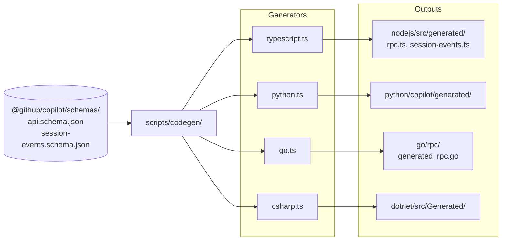

# Codegen Pipeline

How the four SDKs stay in lockstep without any of them being the "primary."

## The source of truth

Not TypeScript. Not Go. Not any SDK code.

**JSON Schema files** shipped in the `@github/copilot` npm package.

```
node_modules/@github/copilot/schemas/
├── api.schema.json            # RPC method signatures and types
└── session-events.schema.json # Session event shapes
```

These schemas define the protocol. All four SDKs are generated from them.

## The generator flow



## The generators

### TypeScript (`scripts/codegen/typescript.ts`)

Uses `json-schema-to-typescript` — the simplest generator because TS interfaces map 1:1 to JSON Schema.

Output: plain `.ts` files with interfaces, enums, and type aliases.

### Python / Go / C# (`scripts/codegen/{python,go,csharp}.ts`)

All three use `quicktype-core` (v23.2.6). Quicktype is a multi-language code generator that accepts JSON Schema and emits idiomatic code per language:

- Python: dataclasses with type hints
- Go: structs with JSON marshaling tags
- C#: classes with source-gen JSON context

### Why TypeScript generators?

The generator scripts themselves are written in TypeScript. A single language for the generator pipeline, executed via `tsx` (or `ts-node`), keeps the tooling consistent.

## Running codegen

```bash
cd scripts/codegen
npm install
npm run generate
```

This runs all four generators sequentially. The repo's `justfile` exposes:

```bash
just generate-rpc      # runs the full codegen
```

## Schema preprocessing

Before handing the schema to generators, `scripts/codegen/utils.ts` runs transformations:

### `postProcessSchema()`

Converts boolean const values (e.g., `"const": true`) into single-valued enums. Quicktype doesn't handle boolean constants well; this normalizes them.

### `normalizeNullableRequiredRefs()`

Fixes schema defects where a property is marked `required` but its type definition says `nullable: true`. The transform rewrites these to be optional + nullable-typed.

### Loading

```typescript
import schema from "@github/copilot/schemas/api.schema.json";
```

The SDK codegen package depends on `@github/copilot` — bumping the Copilot CLI version picks up the new schema automatically.

## Version sync

### Protocol version

Stored in `/sdk-protocol-version.json`:

```json
{
  "version": 3,
  "minimumSupported": 2
}
```

A script propagates this to each SDK:

```bash
tsx nodejs/scripts/update-protocol-version.ts
```

Outputs:
- `nodejs/src/sdkProtocolVersion.ts`
- `python/copilot/protocol_version.py`
- `go/sdk_protocol_version.go`
- `dotnet/src/ProtocolVersion.cs`

Each becomes a compile-time constant referenced during protocol negotiation.

### CLI version

Tracked separately via npm / pip / NuGet / Maven dependency pins. When a new CLI drops, someone bumps the pin and re-runs codegen — which pulls the new schema.

## The `corrections/` folder

A somewhat surprising piece: `/scripts/corrections/`.

### What it is NOT

It is NOT a patch directory. There are no "apply this diff after codegen runs" scripts.

### What it IS

A **feedback aggregation system**. `collect-corrections.js` tracks when users or internal tooling report codegen quality issues:

- Maintains a triage tracking GitHub issue (labeled `triage-agent-tracking`)
- Collects N ≥ 10 correction reports
- When threshold hit, auto-assigns to Copilot Code Assistant (CCA)
- Posts a markdown table of issues for CCA to analyze

So it's not improving the current codegen output — it's a feedback loop that causes the generators themselves to be improved over time.

## Docs validation pipeline

Related but distinct: `/scripts/docs-validation/`.

### Purpose

Every code block in every doc file must compile across all four SDKs. This catches:
- Example code drift from actual API shape
- Typos that break the sample
- Cross-SDK inconsistencies

### How

**`extract.ts`** parses Markdown in `/docs/`, pulls out code blocks by language, writes them to `/docs/.validation/`:

```
docs/.validation/
├── typescript/
│   └── <filename>.ts
├── python/
│   └── <filename>.py
├── go/
│   └── <filename>.go
└── csharp/
    └── <filename>.cs
```

Directives in Markdown control extraction:

- `<!-- docs-validate: skip -->` — omit the next code block
- `<!-- docs-validate: hidden -->` — full compilable code, invisible in rendered output
- `<!-- docs-validate: wrap-async -->` — wrap Python code in `async def main():`

**`validate.ts`** runs the appropriate compiler:

| Language | Validator |
|---|---|
| TypeScript | `tsc` with path mapping to local SDK |
| Python | `py_compile` (syntax) + `mypy` (types) |
| Go | `go mod tidy` + `go build` |
| C# | `dotnet build` against local project reference |

Failures reported as `source_file:line` with actionable errors.

### Commands

```bash
just validate-docs         # all languages
just validate-docs-ts      # TypeScript only
just validate-docs-py      # Python only
just validate-docs-go      # Go only
just validate-docs-cs      # C# only
```

## The `justfile` — build orchestration

Top-level commands operate across all languages:

```bash
just install     # all deps
just format      # all languages
just lint        # all languages
just test        # all languages
```

Per-language variants: `just {install,format,lint,test}-{nodejs,python,go,dotnet}`.

Scenario tests:

```bash
just scenario-build       # build all scenarios
just scenario-verify      # E2E verification with real CLI
just playground           # interactive SDK demo
```

Full CI pipeline:

```bash
just install && just format && just lint && just test && just validate-docs
```

## How features ship across SDKs

When a new feature lands:

1. **Schema update**: `@github/copilot` npm release with new JSON Schema
2. **Protocol version bump** if breaking
3. **`just generate-rpc`** to regenerate all four SDKs
4. **SDK wrapper additions**: handwritten high-level APIs (e.g., `session.rpc.mode.set`) added in each SDK's `session.ts`/`session.py`/`session.go`/`Session.cs`
5. **Tests**: mirrored across all four (`nodejs/test/e2e/`, `python/e2e/`, `go/internal/e2e/`, `dotnet/test/`)
6. **Docs**: updated with code blocks — automatically validated via docs-validation

CHANGELOG makes cross-SDK parity explicit:

> v0.2.1 — "Commands and UI elicitation across all four SDKs"
> v0.2.0 — "OpenTelemetry support across all SDKs"

When something lands in one SDK but not others, it's treated as a bug.

## Recent major releases (from CHANGELOG)

### v0.2.2 (2026-04-10)

- `enableConfigDiscovery` — auto-discover `.mcp.json`, `.vscode/mcp.json`, skills directories

### v0.2.1 (2026-04-03)

- Commands and UI elicitation across all four SDKs
- `session.getMetadata()` without full resume
- Node.js: `sessionFs` adapter
- Structured tool results shipped as objects (not stringified)

### v0.2.0 (2026-03-20)

- Fine-grained system prompt customization (10 sections)
- OpenTelemetry across all SDKs with W3C trace context
- Blob attachments (inline base64)
- Pre-select custom agent at session creation
- New RPC: `skills.*`, `mcp.*`, `extensions.*`, `shell.exec`, `session.log`
- `@experimental` API annotations

### v0.1.31–v0.1.32 (March 2026)

- Protocol v3: multi-client broadcasts
- Backward compatibility with v2 servers
- Strongly-typed permission results in .NET and Go

## Gotchas

1. **Don't hand-edit generated files.** They'll be overwritten on next codegen. Add your wrappers in the handwritten files next to them (`client.ts`, `session.ts`, etc.).
2. **Schema renames break silently in `customize` mode.** When a system prompt section is renamed, your customize config becomes a no-op. Retest after SDK upgrades.
3. **Codegen generator versions matter.** `quicktype-core` 23.2.6 is pinned; upgrading may change output shape.
4. **Docs validation catches drift.** CI runs it. If a doc example stops compiling, CI fails.

## See also

- [transport-and-protocol.md](transport-and-protocol.md) — the wire protocol being generated
- [test-harness.md](test-harness.md) — how changes are verified end-to-end
- [../08-reference/rpc-methods.md](../08-reference/rpc-methods.md) — the generated API surface
