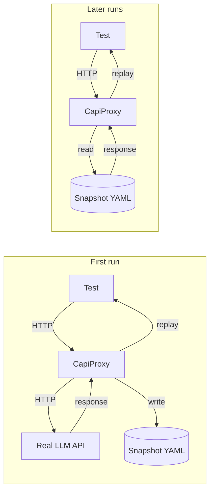

# Test Harness

How the SDK's tests run deterministically without making real LLM calls every time.

## The problem

E2E tests for an LLM-powered system normally have three bad options:

1. **Mock the LLM**: tests pass but don't reflect reality
2. **Call the real LLM**: tests are slow, non-deterministic, and cost money
3. **Skip tests**: regressions slip through

None are good. So the Copilot SDK uses a fourth approach: **record/replay**.

## The pattern

First run records. Subsequent runs replay.



Tests are deterministic, fast, and free to run.

## Architecture

```
[ Test runner (vitest / pytest / go test / xunit) ]
         │
         ▼
[ CopilotSession / CopilotClient ]
         │ spawns
         ▼
[ copilot CLI ]
         │ HTTPS
         ▼
[ CapiProxy — intercepting HTTP proxy ]
         │
         ▼
[ Snapshot YAML file on disk ]
   (records first run, replays subsequent)
```

The CLI doesn't know it's being tested. The proxy is transparent — it just looks like the normal LLM API endpoint.

## CapiProxy: the core

Lives at `/test/harness/`. Node.js-based even for .NET/Python/Go tests (they spawn it as a subprocess).

### Files

| File | Purpose |
|---|---|
| `server.ts` | Entry — starts `ReplayingCapiProxy` |
| `replayingCapiProxy.ts` | HTTP proxy with record/replay |
| `capturingHttpProxy.ts` | Base class for HTTP capture |
| `util.ts` | YAML/snapshot utilities |
| `test-mcp-server.mjs` | Sample MCP server for tests |
| `package.json`, `vitest.config.ts` | Node setup |

### Redirecting the CLI

The test harness starts the proxy on a random port, then spawns the CLI with:

```bash
COPILOT_API_URL=http://localhost:$PROXY_PORT
```

The CLI thinks this is the real Copilot API and sends all LLM traffic there.

### Endpoints exposed by the proxy

| Endpoint | Method | Purpose |
|---|---|---|
| `/config` | POST | Update snapshot file path and working directory |
| `/exchanges` | GET | Retrieve captured HTTP exchanges |
| `/stop` | POST | Stop the proxy; optional flag to skip writing updates |
| `/models` | GET | Return stored or default model list |
| `/chat/completions` | POST | Replay or record LLM completion |

### The replay logic

From `replayingCapiProxy.ts`:

```typescript
if (state.storedData && path === "/chat/completions") {
  const savedResponse = await findSavedChatCompletionResponse(
    state.storedData,
    request.body,
    state.workDir,
    state.toolResultNormalizers,
  );

  if (savedResponse) {
    // Replay the stored response
    if (slowStreaming) {
      // Throttle to ~2KiB/sec for streaming fidelity
      return throttledReplay(savedResponse);
    }
    return instantReplay(savedResponse);
  }

  // No matching snapshot — check if request-only (e.g., timeout test)
  if (await isRequestOnlySnapshot(...)) {
    return hangForever;   // let client timeout
  }

  // No match at all — call real API (record mode)
}
```

### Matching strategy

A request matches a snapshot when:

- Endpoint matches
- Model matches
- Messages array matches after normalization
- Tools list matches

Mismatches mean the test code changed in a way that produces a different request — which means the snapshot is stale and should be regenerated.

## Snapshot YAML format

Lives under `/test/snapshots/<test-file>/<test-name>.yaml`.

### Structure

```yaml
models:
  - id: "gpt-5"
    name: "GPT-5"
    capabilities: {...}

exchanges:
  - request:
      endpoint: "/chat/completions"
      body:
        model: "gpt-5"
        messages:
          - role: "system"
            content: "${workdir}/..."
          - role: "user"
            content: "Analyze main.ts"
        tools:
          - name: "${shell}"
          - name: "${read_shell}"
    response:
      status: 200
      body: {...}      # full OpenAI-format response
      streaming: true  # indicates SSE response
```

### Path and tool name normalization

Cross-platform portability means paths and tool names vary. The snapshot uses variables:

| Variable | Expands to |
|---|---|
| `${workdir}` | test's working directory |
| `${shell}` | platform-appropriate shell tool name |
| `${read_shell}` | read-only shell tool |
| `${write_shell}` | write-enabled shell tool |

At replay time, variables in the snapshot are resolved to current values. At record time, current values in the request are canonicalized back to variables. This lets snapshots work on macOS, Linux, Windows, and across test runs with different temp dirs.

### Tool result normalizers

For tool results that contain large or variable content (file contents, timestamps, UUIDs), normalizers strip or canonicalize them before matching. E.g., a `view` tool's output might get truncated to `${LARGE_FILE_CONTENT}` in snapshots.

## Cross-language harness use

All four SDKs share the same Node.js harness.

### Node.js

Direct import:

```typescript
import { CapiProxy } from "./harness/CapiProxy";

const proxy = new CapiProxy();
const url = await proxy.start();
```

### Python

Spawns the Node harness via subprocess:

```python
from e2e.testharness import CapiProxy

proxy = CapiProxy()
url = await proxy.start()
```

The Python `CapiProxy` runs `npm run start` in `/test/harness/` and parses the "Listening: http://..." line.

### Go

Same pattern — `go/internal/e2e/testharness/proxy.go` spawns `npm run start`.

### .NET

`dotnet/test/Harness/CapiProxy.cs` does the same.

All four end up pointing their CLI at the shared Node harness.

## Writing a new E2E test

### Node.js example

```typescript
import { makeSdkTestContext } from "./harness/sdkTestContext";

test("should echo user message", async () => {
  const ctx = await makeSdkTestContext(__filename, "echo_user_message");

  const session = await ctx.client.createSession({
    onPermissionRequest: approveAll,
  });

  const msg = await session.sendAndWait({ prompt: "Say hi" });
  expect(msg.data.content).toContain("hi");

  await session.disconnect();
  await ctx.cleanup();
});
```

On first run (`UPDATE_SNAPSHOTS=1`), the test hits the real API and writes `/test/snapshots/echo_user_message.yaml`. On subsequent runs, it replays.

### Python example

```python
@pytest.mark.asyncio
async def test_echo(sdk_context):
    session = await sdk_context.client.create_session(
        on_permission_request=PermissionHandler.approve_all,
    )
    msg = await session.send_and_wait(prompt="Say hi")
    assert "hi" in msg.data.content
```

## Updating snapshots

When the expected behavior changes (new feature, prompt change, etc.):

```bash
UPDATE_SNAPSHOTS=1 just test
```

The proxy calls the real API, writes new snapshots. Review the diffs; commit if correct.

## The `sdkTestContext` helper

All E2E tests use a shared context helper that:

1. Starts the CapiProxy on a random port
2. Creates a fresh tmp working directory
3. Sets `COPILOT_API_URL` to the proxy
4. Configures the SDK client
5. Yields the context to the test
6. Cleans up on teardown

Nodes: `nodejs/test/e2e/harness/sdkTestContext.ts`
Python: `python/e2e/testharness/context.py`
Go: `go/internal/e2e/testharness/context.go`
.NET: `dotnet/test/Harness/E2ETestContext.cs`

## Slow streaming mode

Some tests verify streaming deltas arrive correctly. Replay-at-wire-speed would produce instant deltas, defeating the test. So:

```typescript
ctx.setSlowStreaming(true);
```

This causes the proxy to throttle the response to ~2KiB/sec, triggering actual delta events. Without this, all deltas arrive in one frame.

## Request-only snapshots (timeout tests)

To test client-side timeout behavior, the snapshot YAML includes a request but no response. The proxy receives the request and hangs forever. The client's timeout fires.

```yaml
exchanges:
  - request:
      endpoint: "/chat/completions"
      body: {...}
    # no response field — proxy will hang
```

## Test isolation

- Each test gets a fresh tmp working directory (so `${workdir}` is stable)
- Each test gets a fresh proxy instance (no state bleed)
- Sessions are disconnected and cleaned up in `afterEach`

## Gotchas

1. **Flaky tests often mean non-deterministic prompts**. If the LLM sees slightly different input each run (timestamps, PIDs, etc.), snapshots won't match. Sanitize inputs.
2. **Normalizers must match between record and replay**. If you add a new normalizer, re-record affected snapshots.
3. **The proxy is Node.js only**. You need `npm` available even if your SDK is Python/Go/.NET.
4. **Model version changes invalidate snapshots**. Model upgrades produce different outputs. Budget time to re-record before shipping.
5. **Slow streaming mode is per-test**. Don't globally enable; it slows tests unnecessarily.

## See also

- [transport-and-protocol.md](transport-and-protocol.md)
- [codegen-pipeline.md](codegen-pipeline.md)
- [../03-sdk-comparison/feature-parity-matrix.md](../03-sdk-comparison/feature-parity-matrix.md)
